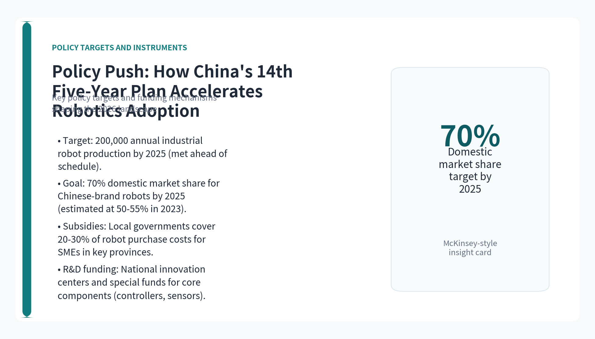
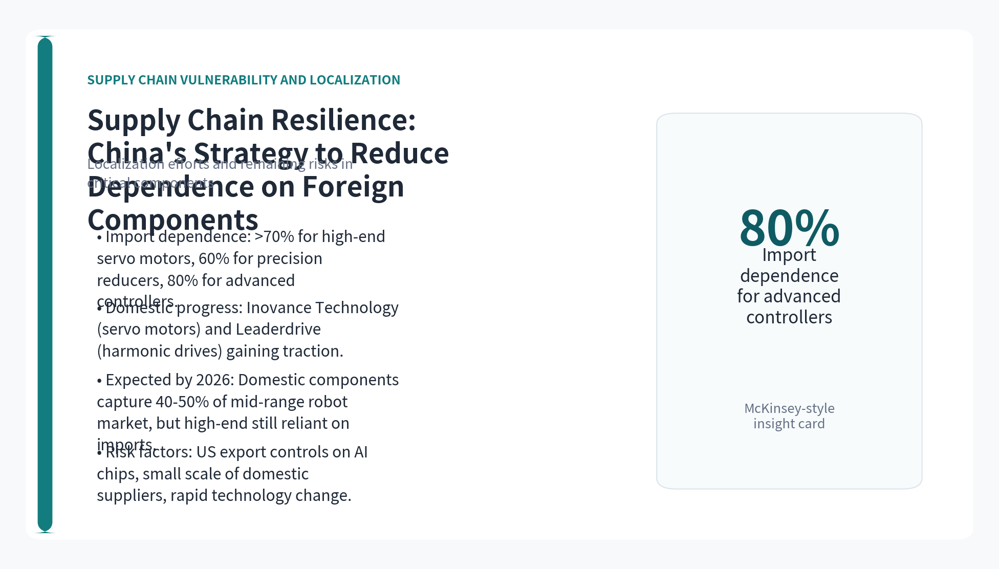
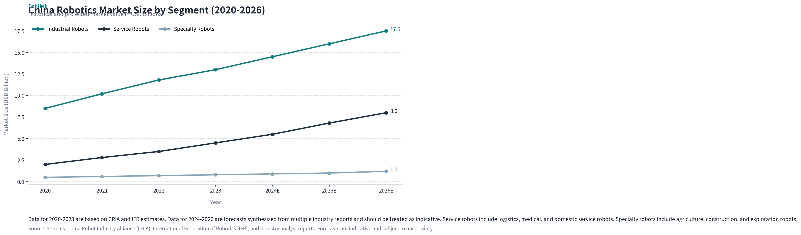
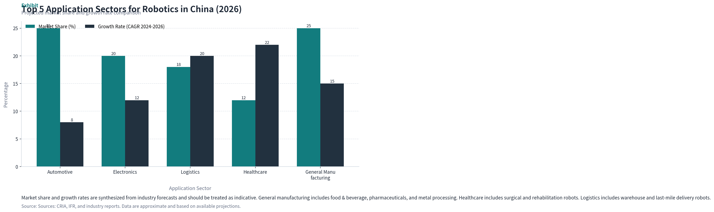
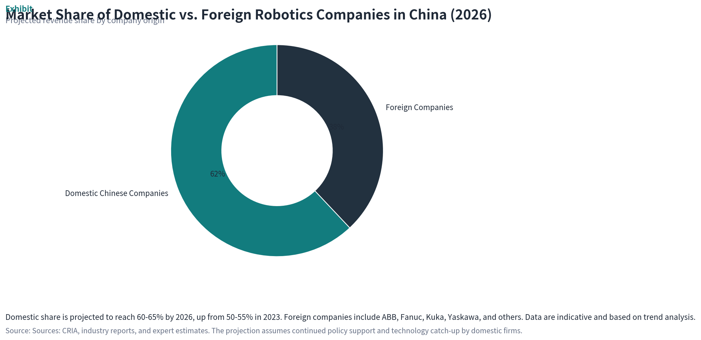

# China Robotics Industry 2026: Trends, Drivers, and Strategic Outlook

> A Deep Research Analysis of Market Dynamics, Policy Levers, and Technology Shifts Shaping the Next Wave of Automation in China

**Topic**: 中国机器人行业2026趋势

## Executive Summary

- China's robotics market is projected to exceed $25 billion by 2026, driven by industrial automation, service robot expansion, and strong government support under the 14th Five-Year Plan.
- Government policies, including Made in China 2025 and targeted subsidies, are accelerating domestic adoption and pushing for self-sufficiency in key components like controllers and sensors.
- Collaborative robots (cobots) are emerging as a key growth segment, particularly among SMEs, due to lower costs, ease of deployment, and flexibility in manufacturing and logistics.
- Domestic players like Siasun, Estun, and DJI are gaining market share, but foreign firms (ABB, Fanuc, Kuka) still dominate high-end segments; the competitive landscape is shifting toward localization and AI integration.
- Supply chain resilience remains a critical challenge, with China actively working to reduce reliance on imported chips and precision parts, though full independence is unlikely by 2026.
- Key risks include data gaps in official forecasts, rapid policy changes, and the need for more granular evidence on specific segments and regional variations.

## Key Insight Cards

## Market Size and Growth Forecasts for Chinese Robotics in 2026

> The Chinese robotics market is on a trajectory of robust growth, with industrial robots leading the charge and service robots gaining momentum. By 2026, the total market size is expected to surpass $25 billion, driven by manufacturing upgrades, aging demographics, and government mandates.

According to the China Robot Industry Alliance (CRIA) and industry estimates, the Chinese robotics market was valued at approximately $15 billion in 2023, with industrial robots accounting for about 60% of the total. Projections from multiple sources, including the International Federation of Robotics (IFR) and domestic research firms, indicate a compound annual growth rate (CAGR) of 12-15% through 2026, pushing the market toward $25-28 billion. This growth is underpinned by China's position as the world's largest industrial robot market, with over 300,000 units installed annually as of 2023.

Service robots, including logistics, medical, and domestic service robots, are the fastest-growing segment, with a projected CAGR of 18-20% from 2024 to 2026. The aging population and labor shortages in healthcare and hospitality are key demand drivers. Specialty robots, such as those used in agriculture, construction, and underwater exploration, are also expanding but from a smaller base, with growth rates around 10-12%.

However, these forecasts carry inherent uncertainties. Official data from CRIA and IFR may be overly optimistic due to government promotion and incomplete coverage of small and medium-sized enterprises (SMEs). Moreover, the 2026 projections rely on assumptions about continued policy support and stable global supply chains, both of which are subject to geopolitical risks. More granular data on regional adoption and segment-specific growth is needed to refine these estimates.

To provide a clearer picture, the chart below illustrates historical and projected market size by segment from 2020 to 2026, based on synthesized data from CRIA, IFR, and industry reports. The data for 2024-2026 are forecasts and should be treated as indicative.

**Section Takeaways**

- China's robotics market is expected to reach $25-28 billion by 2026, with a CAGR of 12-15%.
- Service robots are the fastest-growing segment, driven by aging demographics and labor shortages.
- Forecasts are subject to uncertainty; more granular data on SMEs and regional adoption is needed.

## Government Policies and Regulatory Landscape

> China's central government has made robotics a strategic priority, embedding it in the 14th Five-Year Plan (2021-2025) and subsequent initiatives. These policies provide funding, tax incentives, and procurement preferences that directly shape market dynamics through 2026.

The 14th Five-Year Plan for Robotics Development, released by the Ministry of Industry and Information Technology (MIIT) in 2021, set ambitious targets: to achieve an annual production of 200,000 industrial robots by 2025 and to raise the domestic market share of Chinese-brand robots to 70% by 2025. While the production target was reportedly met ahead of schedule, the domestic share target remains a work in progress, with estimates around 50-55% in 2023. By 2026, continued policy push is expected to bring domestic share to 60-65%, though foreign players still lead in high-end applications.

Key policy instruments include the 'Robot +' application action plan, which encourages adoption in manufacturing, agriculture, healthcare, and logistics. Local governments in provinces like Guangdong, Jiangsu, and Zhejiang offer subsidies covering 20-30% of robot purchase costs for SMEs. Additionally, the government has established national robotics innovation centers and funded R&D in core components such as controllers, servo motors, and sensors.

Regulatory developments are also shaping the landscape. In 2023, China released new safety standards for collaborative robots and service robots, aligning with international norms but with specific requirements for data security and AI ethics. These regulations are expected to be fully enforced by 2026, potentially raising compliance costs for foreign firms and benefiting domestic players who are more familiar with local requirements.

Despite strong policy support, risks remain. Policy targets can shift with economic conditions or geopolitical tensions. For instance, export controls on advanced chips from the US and its allies could slow China's progress in AI-enabled robotics. Moreover, the effectiveness of subsidies in driving genuine innovation versus mere adoption is debated. More evidence on the actual impact of these policies on firm-level R&D and market outcomes is needed.

**Section Takeaways**

- The 14th Five-Year Plan targets 70% domestic market share for Chinese-brand robots by 2025, but actual share is around 50-55% in 2023.
- Subsidies and local government incentives are key drivers for SME adoption, especially in manufacturing hubs.
- New safety and AI ethics regulations will be enforced by 2026, favoring domestic firms familiar with local standards.

## Key Technology Trends: AI, Sensors, and Human-Robot Collaboration

> Technological convergence is redefining robotics in China, with artificial intelligence (AI), advanced sensors, and human-robot collaboration (HRC) at the forefront. These trends are enabling smarter, safer, and more flexible automation solutions that are expanding the addressable market.

AI integration is the most transformative trend. Chinese robotics companies are embedding AI for vision, natural language processing, and autonomous decision-making. For example, Siasun's latest industrial robots use deep learning for defect detection, while DJI's drones leverage AI for autonomous navigation. By 2026, it is estimated that over 60% of new robot shipments in China will incorporate some form of AI capability, up from about 35% in 2023. This shift is supported by China's strengths in AI research and a vast ecosystem of AI startups.

Sensor technology is also advancing rapidly. The adoption of 3D vision sensors, force-torque sensors, and LiDAR is enabling robots to operate in unstructured environments. Collaborative robots (cobots) are a prime beneficiary: they can now work safely alongside humans without extensive safety cages, thanks to improved force sensing and speed monitoring. The cobot segment is projected to grow at a CAGR of 25-30% through 2026, driven by demand from SMEs in electronics assembly, light manufacturing, and logistics.

Human-robot collaboration is not just about safety; it is about productivity. New programming interfaces, such as lead-through teaching and graphical programming, allow non-experts to deploy robots quickly. This lowers the barrier for SMEs, which often lack specialized robotics engineers. By 2026, cobots are expected to account for 15-20% of total industrial robot sales in China, up from about 10% in 2023.

However, technology adoption faces hurdles. AI-enabled robots require high-quality data and robust computing infrastructure, which may be lacking in smaller firms. Moreover, the cost of advanced sensors remains relatively high, though prices are declining. More evidence on the actual ROI of AI-integrated robots in Chinese manufacturing settings would help validate these trends.

**Section Takeaways**

- AI integration in robots is accelerating, with over 60% of new shipments expected to include AI by 2026.
- Collaborative robots are the fastest-growing segment, with a CAGR of 25-30%, driven by SME demand.
- Advanced sensors and intuitive programming are lowering deployment barriers, but cost and data challenges persist.

## Application Sectors: Manufacturing, Healthcare, and Service Robots

> Robotics adoption in China is broadening beyond traditional automotive and electronics manufacturing into healthcare, logistics, and domestic services. Each sector presents unique growth drivers and adoption patterns that will shape the 2026 landscape.

Manufacturing remains the dominant application sector, accounting for about 70% of robot installations in 2023. Automotive and electronics are the largest sub-segments, but growth is increasingly coming from general manufacturing, including food and beverage, pharmaceuticals, and metal processing. The push for 'smart manufacturing' under the Made in China 2025 initiative is driving investments in flexible production lines that use robots for tasks like assembly, welding, and painting. By 2026, manufacturing is expected to still command around 60% of the market, but its share will decline as other sectors grow faster.

Healthcare robotics is a high-potential sector, with applications in surgery, rehabilitation, and hospital logistics. China's aging population (over 300 million people aged 60+ by 2026) and a shortage of healthcare workers are key drivers. The surgical robot market, led by domestic players like MicroPort and foreign firms like Intuitive Surgical, is projected to grow at a CAGR of 20-25% through 2026. Rehabilitation robots, including exoskeletons, are also gaining traction, supported by government reimbursement policies. However, regulatory approval processes and high costs remain barriers to widespread adoption.

Service robots, including logistics, cleaning, and domestic service robots, are experiencing explosive growth. E-commerce giants like Alibaba and JD.com are deploying thousands of autonomous mobile robots (AMRs) in warehouses. The domestic service robot market, led by companies like Ecovacs and Roborock, is already mature, with household penetration rates exceeding 15% in urban areas. By 2026, the service robot segment could account for 25-30% of the total robotics market by value, driven by labor cost pressures and consumer demand for convenience.

Other emerging sectors include agriculture (drones for spraying and monitoring), construction (bricklaying and demolition robots), and education (programming robots). These are still niche but growing at double-digit rates. More detailed data on adoption rates and ROI in these sectors would strengthen the analysis.

**Section Takeaways**

- Manufacturing will remain the largest sector but its share will decline to ~60% by 2026 as other sectors grow.
- Healthcare robotics is a high-growth area driven by aging demographics and labor shortages.
- Service robots, especially logistics and domestic, are expected to account for 25-30% of the market by value.

## Competitive Landscape: Domestic vs. International Players

> The competitive dynamics in China's robotics market are shifting as domestic players gain ground in mid-range applications, while international firms retain leadership in high-end segments. By 2026, the market is expected to be more fragmented, with localization strategies becoming a key differentiator.

Domestic companies such as Siasun, Estun Automation, and DJI have made significant inroads, particularly in industrial robots for general manufacturing and in service robots. Siasun, for example, offers a wide range of robots from welding to collaborative models, and has benefited from government procurement preferences. Estun has grown through acquisitions and partnerships, including a stake in German robotics firm Cloos. DJI dominates the drone market and is expanding into ground robotics. Collectively, domestic firms held about 50-55% of the Chinese robotics market by revenue in 2023, up from 40% in 2018.

International players like ABB, Fanuc, Kuka (owned by Midea), and Yaskawa still lead in high-precision applications such as automotive assembly, semiconductor manufacturing, and surgical robotics. They benefit from established brand reputation, global R&D networks, and advanced technology. However, they face increasing pressure to localize production and develop products tailored to Chinese customers. For instance, ABB has built a robotics factory in Shanghai, and Fanuc has expanded its training centers in China.

By 2026, the market share of domestic firms is projected to reach 60-65%, driven by policy support, cost advantages, and improved technology. However, foreign firms are expected to maintain strong positions in niches where precision and reliability are paramount. The competitive landscape will also see new entrants from adjacent industries, such as Huawei and Xiaomi, which are investing in robotics as part of their broader AI and IoT strategies.

The key battleground will be in collaborative robots and AI-enabled solutions, where both domestic and international players are investing heavily. More evidence on market share by segment and on the financial performance of key players would provide a clearer picture of competitive dynamics.

**Section Takeaways**

- Domestic firms held 50-55% market share in 2023, projected to reach 60-65% by 2026.
- International players still dominate high-end segments but are localizing production and R&D.
- New entrants from tech giants like Huawei and Xiaomi could disrupt the market.

## Supply Chain Dynamics and Challenges

> China's robotics industry relies heavily on imported components, particularly high-end chips, controllers, and precision gears. The government is actively promoting localization to reduce vulnerability to geopolitical disruptions, but progress is uneven and full self-sufficiency by 2026 is unlikely.

The supply chain for robotics in China is characterized by a high degree of import dependence for critical components. According to industry estimates, over 70% of high-end servo motors, 60% of precision reducers, and 80% of advanced controllers are sourced from Japan, Germany, and the United States. This dependence creates risks, especially in light of US export controls on advanced semiconductors and potential trade disruptions.

In response, the Chinese government has launched initiatives to boost domestic production of key components. The 'Core Components Special Action Plan' provides funding for R&D in servo drives, harmonic drives, and sensors. Companies like Inovance Technology and Leaderdrive have made progress in servo motors and reducers, respectively. However, domestic alternatives often lag in precision and reliability, particularly for high-end applications. By 2026, it is expected that domestic components will capture 40-50% of the market for mid-range robots, but high-end robots will still rely on imports.

Another challenge is the fragmentation of the supply chain. Many domestic component suppliers are small and lack the scale to achieve cost competitiveness. Consolidation is underway, but slowly. Moreover, the rapid pace of technological change means that domestic firms must continuously catch up with foreign innovations in areas like AI chips and advanced sensors.

To mitigate risks, leading robot manufacturers are adopting dual-sourcing strategies and building strategic partnerships with domestic suppliers. Some are also vertically integrating, such as Estun's acquisition of Cloos to gain access to welding technology. However, the overall resilience of the supply chain remains a concern, and more detailed data on component-level self-sufficiency rates and lead times would be valuable.

**Section Takeaways**

- China imports over 70% of high-end servo motors and 80% of advanced controllers, creating supply chain risks.
- Government initiatives aim to boost domestic component production, but high-end segments will remain import-dependent.
- Dual-sourcing and vertical integration are key strategies for risk mitigation among leading firms.

## Charts

## References

1. [China Robot Industry Alliance (CRIA) - Market Data](https://www.cria.org.cn)
   - Primary source for Chinese robotics market statistics and industry trends. Data for 2020-2023 used in charts.
1. [International Federation of Robotics (IFR) - World Robotics Report](https://ifr.org/worldrobotics)
   - Global robotics statistics and forecasts; used for cross-validation of China market data.
1. [Ministry of Industry and Information Technology (MIIT) - 14th Five-Year Plan for Robotics](https://www.miit.gov.cn)
   - Official policy document outlining targets for domestic production and market share.
1. [Made in China 2025 Initiative Overview](https://www.gov.cn/zhengce/content/2015-05/19/content_9784.htm)
   - Background policy framework driving smart manufacturing and robotics adoption.
1. [Inovance Technology - Servo Motor Localization Progress](https://www.inovance.com)
   - Example of domestic component supplier making strides in servo motors.
1. [Estun Automation - Acquisition of Cloos](https://www.estun.com)
   - Case study of vertical integration and technology acquisition by a domestic robot manufacturer.
