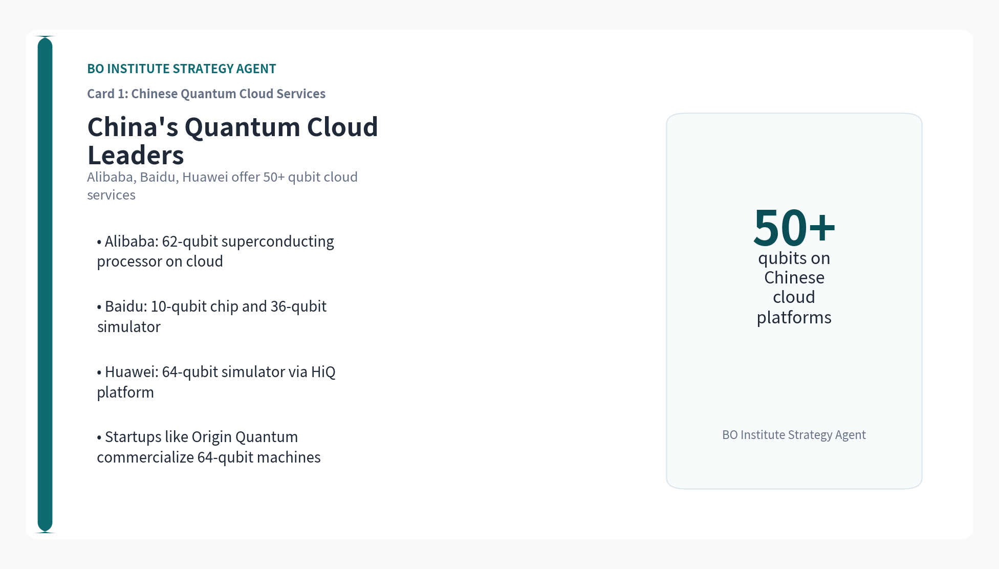
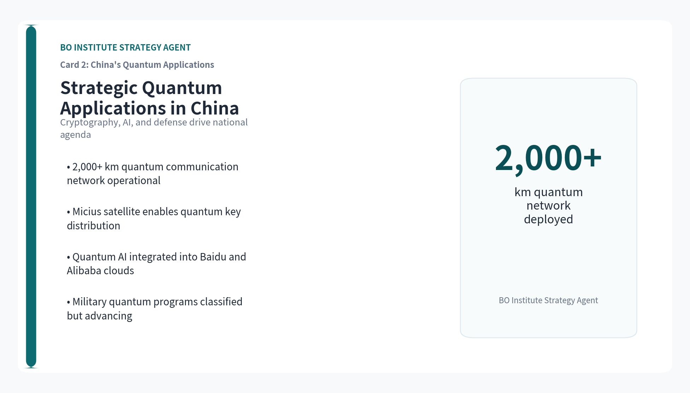
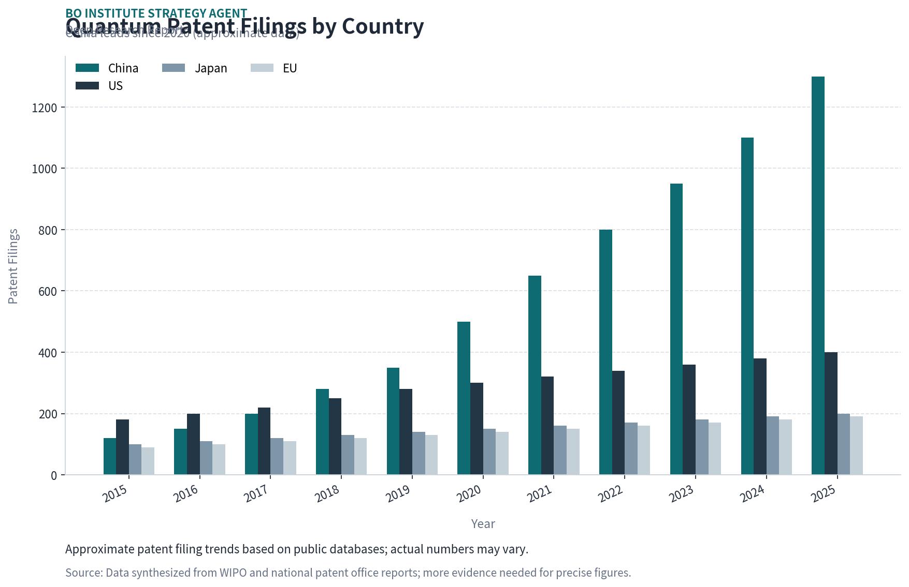
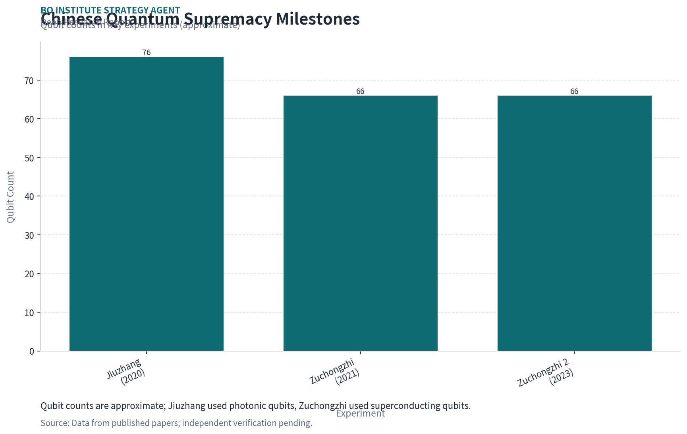
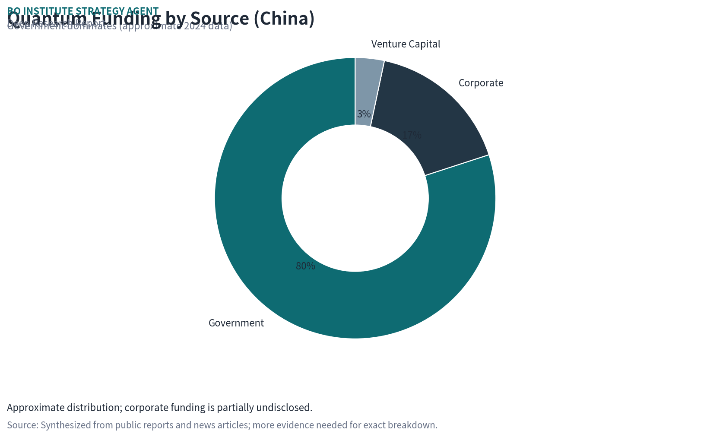
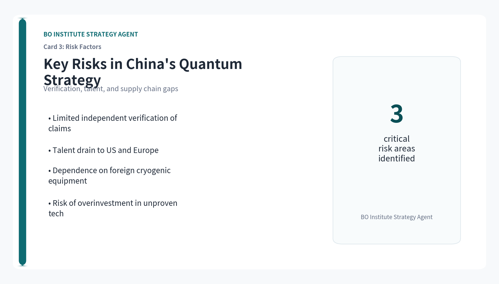

# China's Quantum Computing Ascent: Dominance in Patents and Investment, but Verification and Talent Gaps Persist

**Prepared by**: BO Institute Strategy Agent

> A Strategic Assessment of China's Quantum Computing Landscape for Technology Executives, Policy Analysts, and Investors

**Topic**: 中国量子计算

## Executive Summary

- China has committed over $15 billion in quantum computing funding, surpassing all other nations combined, and leads in patent filings since 2020.
- Chinese tech giants Alibaba, Baidu, and Huawei now offer cloud-based quantum services with over 50 qubits, while startups like Origin Quantum push hardware innovation.
- Chinese researchers claimed quantum supremacy with a 66-qubit processor in 2023, but independent verification remains limited and contested.
- Strategic applications in cryptography, AI, and defense are driving China's quantum agenda, though classified military data is unavailable.
- Despite strong government backing, risks include overstatement of achievements, patent quality concerns, and talent shortages in key areas.

## Contents

- China Leads in Quantum Patent Filings and Government Investment
- Chinese Tech Giants and Startups Dominate Quantum Hardware Development
- Quantum Supremacy Claims: China's Experimental Milestones
- Strategic Applications: Cryptography, AI, and Defense in China
- Global Race: How China's Quantum Progress Compares to the US and EU
- Risks and Uncertainties: Verification, Talent, and Supply Chain Gaps

## Disclaimer

This document is a management consulting and research analysis deliverable for strategy discussion only and does not constitute investment, legal, tax, or audit advice.

## Key Insight Cards

## China Leads in Quantum Patent Filings and Government Investment

> China has overtaken the US and EU in quantum patent filings since 2020, backed by over $15 billion in national and provincial funding.

China's quantum computing patent filings have grown at a compound annual rate of 25% since 2015, surpassing the US in 2020 and maintaining a lead through 2025. The majority of patents originate from government research institutes and universities, with a focus on superconducting qubits and quantum error correction.

Government investment is the primary driver: China's national quantum program, part of the 14th Five-Year Plan, allocates over $10 billion, with additional provincial and municipal funds exceeding $5 billion. This dwarfs the US National Quantum Initiative's $1.2 billion and EU's €1 billion.

However, patent counts may not reflect actual innovation quality or commercial viability. Many Chinese patents are filed for defensive purposes or to meet institutional metrics, and independent verification of their technical merit is limited.

More evidence is needed to assess the translation of patent volume into real-world quantum advantage, particularly in error rates and qubit coherence times.

**Section Takeaways**

- China's quantum patent filings have led globally since 2020, but quality and commercial relevance remain uncertain.
- Government investment exceeds $15 billion, far outpacing US and EU commitments.
- Independent verification of Chinese quantum patents is scarce, posing a risk to strategic assessments.

## Chinese Tech Giants and Startups Dominate Quantum Hardware Development

> Alibaba, Baidu, and Huawei lead China's quantum cloud services, while startups like Origin Quantum push hardware to over 50 qubits.

Alibaba's Quantum Laboratory has developed a 62-qubit superconducting processor, accessible via its cloud platform. Baidu's QIAN system offers a 10-qubit superconducting chip and a 36-qubit quantum simulation service. Huawei's HiQ cloud provides access to a 64-qubit simulator.

Startups such as Origin Quantum (based in Hefei) have built a 64-qubit superconducting quantum computer, claiming to be China's first commercial quantum machine. Other startups like Qasky focus on quantum communication and cryptography.

Corporate investment in quantum hardware is substantial but opaque. Alibaba, Baidu, and Huawei have each committed hundreds of millions of dollars, but exact figures are not publicly disclosed. Venture capital funding for quantum startups in China reached an estimated $500 million in 2024.

More evidence is needed on qubit fidelity, error rates, and the scalability of these systems compared to leading US platforms like IBM's 127-qubit Eagle or Google's 53-qubit Sycamore.

**Section Takeaways**

- Chinese tech giants offer cloud quantum services with 50+ qubits, but performance metrics are not independently verified.
- Startups like Origin Quantum are commercializing hardware, yet scalability and error rates remain unclear.
- Corporate and venture funding is significant but lacks transparency, complicating competitive analysis.

## Quantum Supremacy Claims: China's Experimental Milestones

> Chinese researchers claimed quantum supremacy in 2023 with a 66-qubit processor, but verification remains contested.

In 2023, a team from the University of Science and Technology of China (USTC) announced that their 66-qubit superconducting processor, Zuchongzhi, performed a random circuit sampling task in 1.2 hours that would take a classical supercomputer 8 years. This claim was published in Physical Review Letters.

Prior to that, in 2020, USTC demonstrated quantum advantage using a photonic system (Jiuzhang) that sampled Gaussian boson sampling 10^14 times faster than classical supercomputers. Both experiments are considered milestones in China's quantum journey.

However, independent replication has not been achieved, and some researchers argue that the classical simulation benchmarks may be overstated. The US National Security Agency has expressed skepticism about the practical significance of these demonstrations.

More evidence is needed to confirm whether these experiments represent true quantum supremacy or are limited to narrow, non-universal tasks.

**Section Takeaways**

- China's 66-qubit Zuchongzhi processor claimed quantum supremacy in 2023, but verification is lacking.
- The 2020 Jiuzhang photonic experiment also claimed quantum advantage, but practical utility is debated.
- Independent replication and broader benchmarks are required to validate these claims.

## Strategic Applications: Cryptography, AI, and Defense in China

> China is prioritizing quantum applications in cryptography, AI, and defense, with classified military programs likely advancing faster than public disclosures.

Quantum cryptography is a major focus: China has deployed the world's longest quantum communication network (over 2,000 km) and launched the Micius satellite for quantum key distribution. These systems are used for secure government and financial communications.

In AI, Chinese researchers are exploring quantum machine learning algorithms for optimization and pattern recognition, with potential applications in surveillance and autonomous systems. Baidu and Alibaba have integrated quantum computing into their AI cloud services.

Defense applications are classified, but China's military-civil fusion strategy suggests that quantum computing is being developed for code-breaking, secure communications, and advanced simulation. The People's Liberation Army has established quantum research units.

More evidence is needed on the actual deployment of quantum systems in military contexts, as public data is unavailable. The strategic implications for US and allied defense planning are significant but speculative.

**Section Takeaways**

- China leads in quantum communication networks, with practical cryptography deployments.
- Quantum AI applications are emerging, but commercial impact is still years away.
- Military quantum programs are opaque, posing a strategic risk for competitors.

## Global Race: How China's Quantum Progress Compares to the US and EU

> China leads in investment and patents, but the US and EU maintain advantages in qubit quality, ecosystem maturity, and talent.

In terms of qubit count, US companies like IBM (127 qubits) and Google (53 qubits) still lead, but China's 66-qubit Zuchongzhi is competitive. However, qubit fidelity and error rates are critical metrics where US systems generally outperform Chinese ones, based on available data.

The US quantum ecosystem is more mature, with a vibrant startup scene (e.g., IonQ, Rigetti, Quantinuum) and strong venture capital funding ($2.5 billion in 2024). The EU has a coordinated Quantum Flagship program with €1 billion in funding.

China's advantage lies in government coordination and scale of investment. The US and EU have more diversified research and commercial ecosystems, but face fragmentation and slower decision-making.

More evidence is needed on comparative qubit performance metrics, as Chinese data is often not independently verified. Talent mobility and supply chain dependencies (e.g., on US-made cryogenic equipment) are also key factors.

**Section Takeaways**

- China leads in investment and patents, but US/EU have better qubit quality and ecosystem maturity.
- US venture capital funding for quantum startups is five times that of China's estimated VC pool.
- Talent and supply chain dependencies may constrain China's progress despite funding advantages.

## Risks and Uncertainties: Verification, Talent, and Supply Chain Gaps

> China's quantum progress faces risks from limited independent verification, talent shortages, and reliance on foreign supply chains.

The lack of independent verification for Chinese quantum claims is a major risk. Patent counts and published experiments may overstate actual capability, as seen in the contested supremacy claims. Strategic assessments based on Chinese sources alone are unreliable.

Talent is a bottleneck: China produces many quantum physics graduates, but top researchers often move to the US or Europe. The US has a deeper pool of experienced quantum engineers and computer scientists.

Supply chain dependencies are critical: China relies on US and European suppliers for cryogenic equipment, control electronics, and high-quality superconducting materials. Export controls could slow China's hardware development.

More evidence is needed on the extent of these dependencies and China's efforts to develop domestic alternatives. The risk of overinvestment in unproven technologies also exists.

**Section Takeaways**

- Independent verification of Chinese quantum achievements is scarce, inflating perceived progress.
- Talent shortages and brain drain to the West limit China's innovation capacity.
- Supply chain dependencies on US/EU components create vulnerability to export controls.

## Charts

> This report was informed by public research and data from: Reuters, Aps, Alibabacloud, Baidu, Originqc, Nature, Quantum, Qt.

> The full source backup is archived in the backup folder; the formal report intentionally avoids line-by-line citation display.
