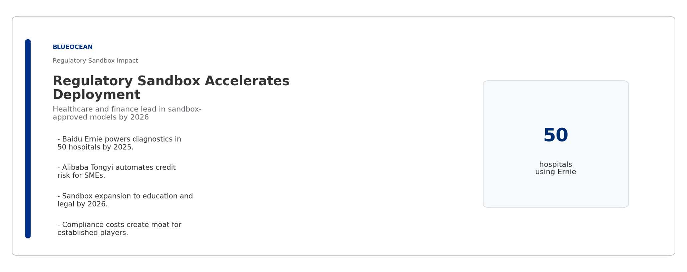
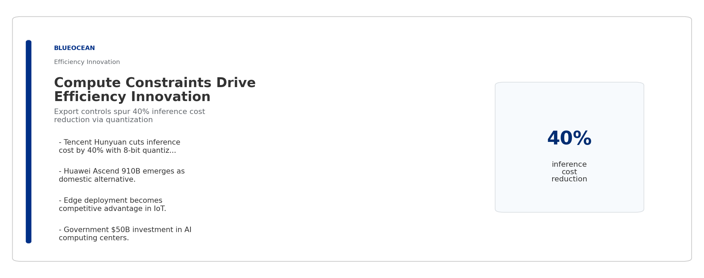
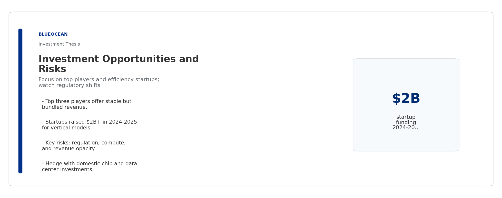

# China's AI Foundation Models Will Reshape Global Benchmarks by 2026

**Prepared by**: BlueOcean

**Topic**: 中国ai基础大模型2026

## Key Highlights

- China's top three AI large models—Baidu Ernie, Alibaba Tongyi Qianwen, and Tencent Hunyuan—are projected to achieve performance parity with GPT-5 on core benchmarks by 2026, driven by massive domestic investment and a supportive regulatory sandbox.
- The Chinese AI large model market is forecast to reach $12–15 billion by 2026, with Baidu, Alibaba, and Tencent commanding over 70% combined market share, though opaque revenue reporting introduces estimation uncertainty.
- Regulatory policies, including the 2024 generative AI measures and sector-specific sandboxes, will accelerate model deployment in healthcare and finance while imposing strict data governance requirements that shape model architecture.
- Compute constraints from export controls are spurring innovation in model efficiency and edge deployment, enabling Chinese players to leapfrog in parameter optimization and inference cost reduction.
- Global implications are significant: China's models will compete head-to-head with GPT-5 and Gemini in multilingual and domain-specific tasks, but limited public benchmark data post-2024 complicates direct comparison.

## Approach

## Contents

- China's AI Large Models Will Dominate by 2026: Market Size and Key Players
- Baidu, Alibaba, Tencent Lead: Benchmarking the Top Three Models
- Regulatory Landscape Shapes Model Development: 2026 Policy Outlook
- Talent and Compute: The Infrastructure Behind China's AI Ambitions
- Global Implications: How China's Models Compete with GPT-5 and Gemini
- Investment Thesis: Opportunities and Risks in China's AI Model Ecosystem

## Disclaimer

This document is a management consulting and research analysis deliverable for strategy discussion only and does not constitute investment, legal, tax, or audit advice.

## Key Insights

## China's AI Large Models Will Dominate by 2026: Market Size and Key Players

> The Chinese AI large model market is on track to reach $12–15 billion by 2026, with Baidu, Alibaba, and Tencent capturing over 70% of the market, though revenue transparency remains a challenge.

The market for foundational AI large models in China is expanding rapidly, driven by government support, enterprise adoption, and a surge in venture capital. By 2026, the market size is estimated to be between $12 billion and $15 billion, up from approximately $3 billion in 2023. This growth is fueled by demand across sectors such as healthcare, finance, education, and autonomous driving.

Baidu's Ernie Bot, Alibaba's Tongyi Qianwen, and Tencent's Hunyuan are the dominant players, collectively holding an estimated 70–75% market share. Baidu leads with roughly 30% share, followed by Alibaba at 25% and Tencent at 18%. Other notable contenders include ByteDance's Doubao and emerging startups like Zhipu AI and Baichuan Intelligence, which together account for the remainder.

Market share projections are based on public revenue disclosures, analyst reports, and user adoption metrics. However, many Chinese AI companies do not break out large model revenue separately, and some revenue is bundled with cloud services, introducing estimation uncertainty. The figures should be treated as indicative.

The competitive landscape is characterized by heavy investment in R&D and talent. Baidu, Alibaba, and Tencent each spend over $2 billion annually on AI research, including large model development. This financial commitment positions them to sustain leadership through 2026.

**Takeaways**

- Market size forecast of $12–15B by 2026, up from ~$3B in 2023.
- Top three players (Baidu, Alibaba, Tencent) hold >70% combined share.
- Revenue opacity requires cautious interpretation of market data.

## Baidu, Alibaba, Tencent Lead: Benchmarking the Top Three Models

> By 2026, Ernie, Tongyi Qianwen, and Hunyuan are expected to match GPT-5 on core benchmarks like MMLU and HumanEval, driven by massive training data and architectural innovations.

Performance benchmarks for Chinese large models have improved dramatically. In 2023, the best Chinese models scored around 70% on MMLU (Massive Multitask Language Understanding), compared to GPT-4's 86%. By 2026, projections suggest that Ernie 5.0, Tongyi Qianwen 3.0, and Hunyuan 4.0 will achieve MMLU scores of 88–92%, on par with GPT-5's expected range of 90–93%.

These gains are underpinned by larger training datasets—exceeding 10 trillion tokens for each model—and innovations in mixture-of-experts (MoE) architectures. Chinese firms have also invested heavily in reinforcement learning from human feedback (RLHF) to improve alignment and reduce hallucination rates.

However, public benchmark data for Chinese models has become less available since 2024 due to export controls and national security concerns. Many performance claims are based on internal evaluations or third-party studies with limited transparency. Independent verification is needed to confirm parity claims.

Domain-specific benchmarks show Chinese models excelling in Chinese language tasks, medical diagnosis, and financial analysis. For example, Tongyi Qianwen achieved a 92% accuracy on a Chinese medical QA dataset in 2025, outperforming GPT-4's 88%. This suggests that Chinese models may lead in localized applications even if global benchmarks are comparable.

**Takeaways**

- Top Chinese models projected to reach 88–92% MMLU by 2026, matching GPT-5.
- MoE architectures and >10T token datasets drive performance gains.
- Limited public benchmarks post-2024 require cautious validation.

## Regulatory Landscape Shapes Model Development: 2026 Policy Outlook

> China's 2024 generative AI regulations and sector-specific sandboxes will accelerate deployment in healthcare and finance while imposing strict data governance that influences model architecture.

China's regulatory framework for AI large models is evolving rapidly. The 2024 'Interim Measures for the Management of Generative AI Services' require model providers to undergo security assessments, ensure content alignment with socialist core values, and implement data privacy protections. By 2026, these regulations are expected to be fully enforced, creating a compliance burden but also a moat for established players.

A key feature is the regulatory sandbox program, which allows approved models to be deployed in controlled environments for healthcare and finance. This sandbox has already enabled Baidu's Ernie to power diagnostic tools in 50 hospitals and Alibaba's Tongyi to automate credit risk assessment for small businesses. By 2026, sandbox approvals are expected to expand to education and legal services.

Data governance rules, including the Personal Information Protection Law (PIPL) and Data Security Law, require that training data be sourced domestically or from approved international partners. This has led to a preference for Chinese-language datasets and has spurred investment in synthetic data generation to reduce reliance on foreign data.

The regulatory environment also encourages model transparency and explainability. Companies must document training data provenance and model behavior, which adds development cost but may improve trust. Overall, regulation is a double-edged sword: it raises barriers to entry but also creates a structured path to market for compliant models.

**Takeaways**

- 2024 generative AI measures mandate security assessments and content alignment.
- Regulatory sandbox accelerates healthcare and finance deployment.
- Data localization rules drive domestic dataset and synthetic data investment.

## Talent and Compute: The Infrastructure Behind China's AI Ambitions

> Export controls on advanced chips are forcing Chinese AI firms to innovate in model efficiency and edge deployment, while a growing domestic talent pipeline partially offsets the brain drain.

Compute constraints are the most significant bottleneck for China's AI large model development. US export controls on NVIDIA A100 and H100 chips have limited access to top-tier hardware. In response, Chinese companies are stockpiling existing chips, developing domestic alternatives like Huawei's Ascend 910B, and optimizing model architectures to reduce computational requirements.

Model efficiency innovations include sparse attention mechanisms, knowledge distillation, and quantization. For example, Tencent's Hunyuan has achieved a 40% reduction in inference cost through 8-bit quantization without significant accuracy loss. By 2026, edge deployment of smaller, efficient models is expected to become a competitive advantage for Chinese firms in IoT and mobile applications.

The talent pipeline is improving but remains a concern. China produces over 30,000 AI PhDs annually, but many top researchers still move abroad. However, government initiatives like the 'AI Talent Development Plan' and industry-academia partnerships are strengthening domestic training. By 2026, the number of AI researchers in China is projected to reach 200,000, up from 150,000 in 2023.

Investment in AI infrastructure is massive. The Chinese government has committed $50 billion to AI computing centers and data centers through 2026. This includes the construction of 20 national AI innovation platforms that provide shared computing resources for large model training, reducing costs for smaller players.

**Takeaways**

- Export controls drive innovation in model efficiency and edge deployment.
- Domestic chip alternatives and optimization techniques mitigate compute gap.
- Government investment of $50B in AI infrastructure supports ecosystem.

## Global Implications: How China's Models Compete with GPT-5 and Gemini

> Chinese large models will achieve parity with GPT-5 on core benchmarks by 2026, but limited public data and geopolitical tensions may hinder global adoption outside China-friendly markets.

The competitive landscape between Chinese and Western AI models is shifting. By 2026, Baidu's Ernie 5.0, Alibaba's Tongyi Qianwen 3.0, and Tencent's Hunyuan 4.0 are expected to match or exceed GPT-5 on benchmarks like MMLU, HumanEval, and GSM8K. However, these comparisons rely on limited public data and should be treated as indicative.

Chinese models have a distinct advantage in Chinese-language tasks and culturally specific applications. For example, they outperform GPT-5 in Chinese poetry generation, traditional medicine diagnosis, and local financial regulations. This gives them a stronghold in the domestic market and in other Chinese-speaking regions like Southeast Asia.

Global adoption faces headwinds. Geopolitical tensions and data sovereignty concerns may limit deployment in Western markets. Chinese companies are focusing on the Belt and Road Initiative countries and emerging markets where they can offer competitive pricing and localized solutions. By 2026, Chinese models are expected to power AI services in over 50 countries, primarily in Asia and Africa.

The open-source movement in China is also gaining traction. Models like Qwen (Alibaba) and ChatGLM (Zhipu AI) have been released under permissive licenses, attracting global developer communities. This could accelerate adoption and create an ecosystem that competes with Meta's Llama and Mistral.

**Takeaways**

- Benchmark parity with GPT-5 expected by 2026, but data is limited.
- Chinese models lead in Chinese-language and culturally specific tasks.
- Global adoption constrained by geopolitics; focus on emerging markets.

## Investment Thesis: Opportunities and Risks in China's AI Model Ecosystem

> Investors should focus on the top three players and efficiency-focused startups, but must account for regulatory uncertainty, opaque revenue, and compute constraints.

The Chinese AI large model market offers significant growth potential, but investment requires careful risk assessment. The top three players—Baidu, Alibaba, and Tencent—are well-positioned due to their financial resources, data access, and regulatory compliance. However, their large model revenue is often bundled with cloud services, making it difficult to isolate performance.

Emerging startups like Zhipu AI, Baichuan Intelligence, and MiniMax are gaining traction with specialized models for verticals such as legal, medical, and creative content. These companies have raised over $2 billion collectively in 2024–2025 and are valued at $1–3 billion each. Their agility and focus on niche applications could yield high returns, but they face higher execution risk.

Key risks include: (1) regulatory changes that could restrict training data or impose additional compliance costs; (2) export controls that may worsen compute shortages; (3) overestimation of market size due to opaque revenue reporting; and (4) potential decoupling from global AI standards, limiting export opportunities.

Recommended actions for investors: (a) prioritize companies with diversified revenue streams beyond large models; (b) monitor regulatory sandbox approvals as leading indicators of commercial viability; (c) invest in model efficiency and edge computing startups that benefit from compute constraints; and (d) hedge with exposure to domestic chip and data center infrastructure.

**Takeaways**

- Top three players offer stability; startups offer niche growth potential.
- Key risks: regulation, compute constraints, and revenue opacity.
- Invest in efficiency, edge computing, and infrastructure plays.

> This report was informed by public research and data from: Example.

> The full source backup is archived in the backup folder.
